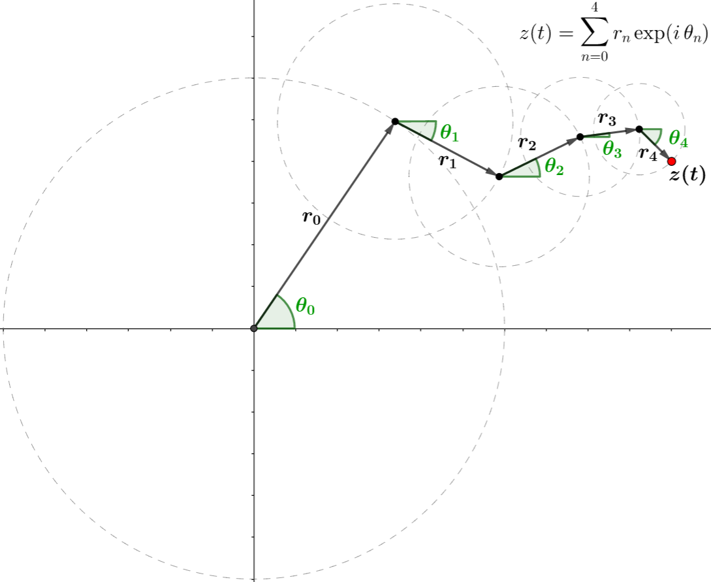
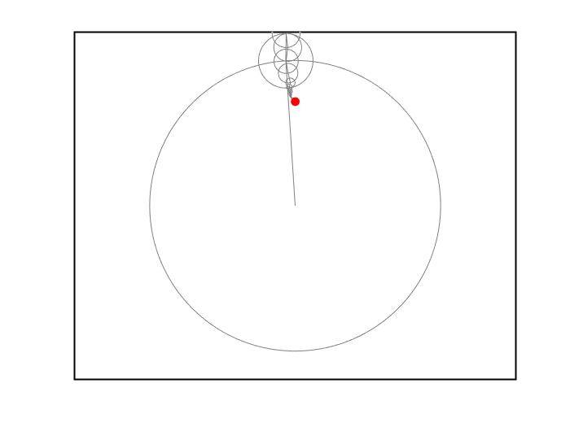

# Fouricle原理及实现方法

## Fourier Series 与 DFT

​	我们要绘制 2 维平面上的任意一条封闭曲线 $\mathcal{C}$，假设它由以时间 $t$ 为参数的方程描述，即：
$$
\mathcal{C}: \left\{ \begin{array}{l} 
	x = f(t)\\ 
	y = g(t) 
\end{array} \right.
, \quad t\in \left[0, T \right]
$$
其中 $T$ 为周期，并且满足 $f(0) = f(T), g(0) = g(T)$ 以保证它是闭的。由Fourier级数理论，可以对 $\mathcal{C}$ 进行[**Fourier级数**](https://en.wikipedia.org/wiki/Fourier_series)展开并保留前 $2M+1$ 项，得到其近似曲线 $\mathcal{S}_{2M+1}$ : 
$$ {equation}
\mathcal{S}_{2M+1}: \left\{ \begin{array}{l}
x = \sum_{n = -M}^M c_f\left( n \right)\exp \left(i\frac{2\pi}{T}nt \right) \\
y = \sum_{n = -M}^M c_g\left( n \right)\exp \left(i\frac{2\pi}{T}nt \right) 
\end{array} \right.
, \; \rm{where} 
\left\{ \begin{array}{l}
c_f(n) = \frac{1}{T}\int_0^T f(t)\exp \left(-i\frac{2\pi}{T}nt \right)\mathrm{d}t \\
c_g(n) = \frac{1}{T}\int_0^T g(t)\exp \left(-i\frac{2\pi}{T}nt \right)\mathrm{d}t
\end{array} \right.
\tag{1.1}
$$ {equation}
​	注意式(1.1)中的横纵坐标仍为 $t$ 的参数方程，但是该式子分析起来是较为复杂的，不妨以复数 $z=x+yi$ 作为变量，则将曲线重新表示为 $\mathcal{C}: z=h(t) = f(t)+g(t)i, \; t\in[0, T]$, 于是 $\mathcal{S}_{2M+1}$ 可重写为：
$$ {equation}
\mathcal{S}_{2M+1}: z = \sum_{n = -M}^M c_h(n) \exp \left(i\frac{2\pi}{T}nt \right), \; {\rm where} \; c_h(n) = \frac{1}{T}\int_0^T h(t) \exp \left(-i\frac{2\pi}{T}nt \right)\mathrm{d}t
\tag{1.2}
$$ {equation}
​	我们现在来分析式(1.2)，它的左半部分是什么意思？给定时刻 $t \in [0,T]$，能得到复平面上一点 $z(t)$，它由 $2M+1$ 个项求和得到，其中每一个项（即右半部分）是一个复数，若用模-幅角表示这个复数，可得：
$$ {equation}
\begin{align}
c_h(n) \cdot \exp \left(i\frac{2\pi}{T}nt \right) &= \left|c_h(n) \right| \cdot \exp \left( i\frac{2\pi}{T}nt + i\arg \left[c_h(n) \right] \right) \\
 &= r_n \cdot \exp \left(i\omega_n t + i\varphi_n \right)  = r_n \cdot \exp[i\,\theta_n(t)]
\end{align}
\tag{1.3}
$$ {equation}
​	其中 $r_n = \left|c_h(n) \right|, \; \omega_n = 2\pi n/ T, \; \varphi(n) = \arg [c_h(n)], \; \theta_n(t) = \omega_n t + \varphi(n)$, 也就是说，求和的第 $n$ 项其实对应于半径为 $r_n$ 的圆上的一点，对应幅角为 $\theta_n(t)$.  那么，整个求和表示什么意思？我想下面这张图已经足以表达了。注意图中的下标与前文不一致，仅作示意用。



​	前面我们讨论的是：对于一个连续曲线 $\mathcal{C}$ 的 $2M+1$ 项 Fourier级数展开的近似曲线 $\mathcal{S}_{2M+1}$. 但是很多时候我们所用的曲线不是由连续的表达式给出的，而是由一系列离散的点给出，即
$$
\mathcal{C}_N: \boldsymbol{z} = \left(z_1, z_2, ..., z_N \right)
$$
​	注意前面的 $\boldsymbol{z}$ 是粗体，表示它是一个向量。此时就不能再用Fourier级数得到 $\mathcal{S}_{2M+1}$, 因为 $c_h(n)$ 计算过程中的积分无法求解。在这种情况下，应该使用[**离散Fourier变换(DFT)**](https://en.wikipedia.org/wiki/Discrete_Fourier_transform)代替Fourier级数。注意我们现在不再是用 $2M+1$ 个项求和来近似 $\mathcal{C}_N$, 而是同样使用 $N$ 个项求和的形式等价地表示 $\mathcal{C}_N$. 具体地，由DFT理论可得：
$$ {equation}
\mathcal{S}_N: w_n = \sum_{k=0}^{N-1} c_k \cdot \exp \left(i\frac{2\pi nk}{N} \right)
, \; {\rm where}\; c_k = \sum_{n=0}^{N-1} z_n \cdot \exp \left(-i \frac{2\pi nk}{N} \right)
\tag{1.4}
$$ {equation}
​	式(1.4)的左半部分与式(1.2)一致，只是系数的计算方法由积分变为了求和，因此它的分析方式是类似的。注意这里的 $\mathcal{S}_N$ 不是在近似 $\mathcal{C}_N$, 而是两者完全等价，表示同一条曲线，即 $w_n = z_n, \; n=0,1,...,N-1$. 为什么我要有意的用不同符号区分它们呢？因为在之后会介绍线简化算法，即通过平滑采样、过滤或手动调节等方法来改变原始曲线数据，使其更光滑且能用尽可能少的点来表示。*无论在什么语境中，我总是使用 $\mathcal{C}$ 来表示原始曲线数据，而用 $\mathcal{S}$ 表示实际用于绘图的曲线数据。*

​	下面给出该部分的实现方法：

```matlab
% --- 获得圆数据, w(:,k+1)表示第k+1时刻每个圆的圆心坐标，w(0,k+1) = 0+0i
function [w, radius] = getCircles(z, N)
	c = fft(z, N) / N;              			% 对复数序列做DFT(使用计算更快的fft)
	[radius, index] = sort(abs(c), 'descend');  % 每个圆的半径(降序)和对应索引
	phase = angle(c(index));                    % 每个圆的初相角(降序)
	freq = 2 * pi * (index - 1) / N;            % 每个圆的频率(降序)
	w = zeros(N + 1, N, 'like', 1+1i);			% 预分配内存: (N+1)×N 的全零复数矩阵
	for k = 0:N-1
		w(2:N+1, k+1) = cumsum(radius .* exp(1i*(freq * k + phase)));
    end
 end
```

​	*上述代码与源代码不完全一致，是为了便于读者理解而做了适当的修改。*其中我们按半径降序重新排列了这些圆，这是为绘图美观考虑的，使其能够以大圆套小圆的方式绘制。由于我们需要得到 $k=0,1,...,N-1$ 时的所有圆的数据，只需要得到它们的圆心坐标就行了。我们固定第一个圆心在原点，即 `w(0,:) = 0+0i`, 由于`w`初始即为全0复数矩阵，所以实际上无需作修改。`w(n,k+1)`表示的是第 $k+1$ 时刻的圆心坐标，它其实就是式(1.4)左半部分前 $k+1$ 项的和，注意 `cumsum(x)` 得到的是 `x` 的累积和。`freq(n)`表示的是第 $n$ 个圆转动的频率，相当于式(1.3)中的 $\omega_n$. 为便于绘图，我们还将降序后的半径作为输出，具体的绘图方式如下： 

```matlab
% --- 在给定坐标轴ax上绘制动画,其中 u,v 分别为 w 的实部和虚部
function draw_epicycle(ax, x, y, u, v, radius, N)
	for k = 1:N
    	cla(ax);	% 清除坐标区现在的曲线数据
        viscircles(ax, [u(1:N, k), v(1:N, k)], radius), hold(ax, 'on');	% 每个圆周
        line(ax, u(:, k), v(:, k)), hold(ax, 'on');			% 两个圆心之间的连线
        line(ax, x(1:k), y(1:k)),	hold(ax, 'on'); 		% 已绘制的曲线数据
        plot(ax, u(end, k), v(end, k)), hold(ax, 'off');	% 当前绘制的曲线上的点
        drawnow;	% 更新图窗，使图像立即在屏幕上显示
  	end
end
```

​	*上述代码中省略了控制图形属性的参数项，具体的参数可以参考源代码。*该函数生成的动画如下（pdf只能看图片，要查看动画请使用Markdown或HTML打开）：



## 线简化算法

### 样条平滑采样


### 贝塞尔平滑采样


### N-th Point算法


### 径向距离滤除


### 垂直距离滤除


### Opheim算法


### Lang算法


### Douglas-Peucker算法


### Visvalingam算法


### Reumann-Witkam算法


### Zhao-Saalfeld算法


## 图像分割

### 边缘检测算法


### 描图画线


### 自动从图像中生成曲线

